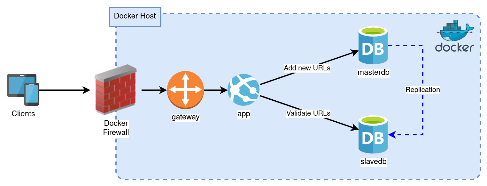

# URL Lookup Service
URL Lookup service is an API application built in Python language and it provides the capability to lookup an URL to validate if it’s safe to access and to update the database for any new unsafe URLs. This was created as part of the technical challenge for the Cisco interview process.

To start up the environment, please run the following command in the same directory where docker-compose.yml resides in to get the containers up and running:

```docker-compose --compatibility up --build```

This will spin up the gateway which will forward the HTTP requests from http://localhost/ to the internal Docker IP where the app containers run on.

## Infrastructure



## Scalability

The gateway, web service and the database are running in a Docker environment to grant the ability to scale up or downsize the number of web services and read-only databases (slavedb) to meet the demand. Currently the docker-compose file is configured to deploy two app (web service) and two slavedb containers. The number of app and slavedb containers can be changed by changing the numeric value under deploy.replicas.

## API Guide

This application has two API endpoints, one to validate a specific URL and other to add a list of URLs to the database:

### GET /urlinfo/1/<host_port>/<original_path_and_query>

Validates if a URL is safe or not to access. The API will access the PostgreSQL and check to see if the URL exists in the database. If it exists, it will respond that it is found and will return if it's safe or not based on the is_safe field in the database table. If the URL does not exist in there, it will return stating that it does not exist. Please see below for an example on how to make the API call and some examples of the output:

API Call: `GET http://localhost/urlinfo/1/facebook.com/example/path/to/image.png`

Successful JSON Output if unsafe URL is in database:

```
{
	‘success’: True,
	‘data’: {
		‘found’: True,
		‘is_safe’: False
	}
}
```

Successful JSON Output if URL doesn’t exist in database:

```
{
	‘success’: True,
	‘data’: {
		‘found’: False
	}
}
```

### POST /urladd/1

Add a list of unsafe URLs to the database. Please see below for an example on how to make the API call and some examples of the output:

API Call: `POST http://localhost/urladd/1` with the following data:
```
{
	‘data’: [
		[‘facebook.com’, ‘example/path/to/image.png’],
		[‘google.com’, ‘example/page’]
	]
}
```

Successful JSON Output:
```
{
	‘success’: True
}
```

There are two scripts, read_test.py and write_test.py, that will perform the API test calls for your convenience.

## Future Enhancements

### Kubernetes Environment

Based on the infrastructure setup for the URL lookup service, it is ideal to run it in Kubernetes 	cluster instead of a single Docker host to take advantage of their high availability and easy 	scaling without any downtime.
	
### PostgreSQL Cluster

If the size of data in the database is getting too big for a traditional replication environment, a sharding and replicas type environment might help with allowing read intensive workloads 	while distributing the data among several databases.

### Security

Improve the security to restrict who is allowed to access the write part of the API endpoint. This 	can be done with using token system.

